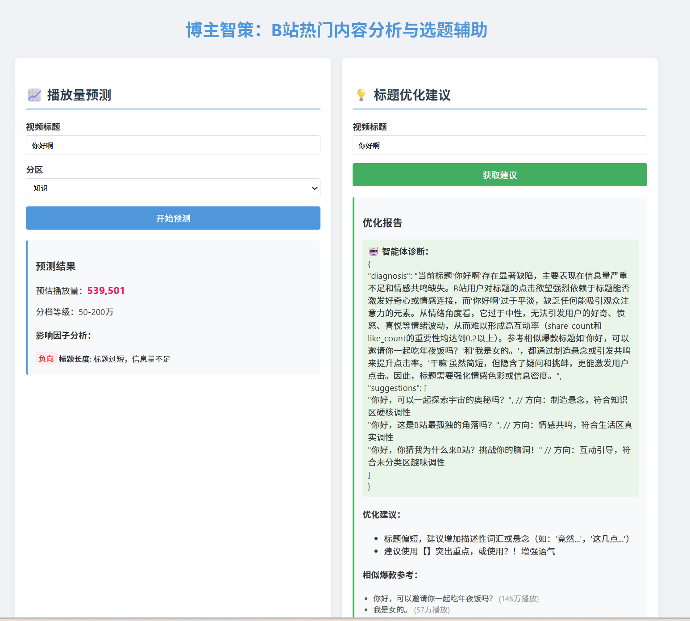
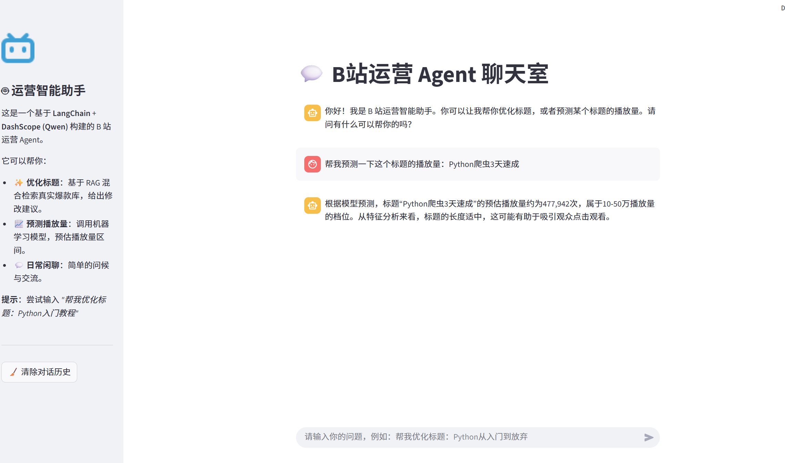

# 博主智策：B站内容分析与 AI 运营助手 (RAG + Agentic Workflow)

本项目是一个工业级的 B 站自媒体运营辅助系统。它完整跑通了 **“数据采集 → 特征工程 → 机器学习预测 → 知识库构建 (RAG) → 智能体交互 (Agent)”** 的全链路落地流程。

## 🌟 你能得到什么？

- **🤖 交互式 AI 运营助手**：基于 LangChain 和 Streamlit 构建的 Web Agent，支持多轮对话、动态工具调度（Tool Calling），为你提供个性化的标题优化与流量诊断。
- **📊 混合检索增强 (RAG)**：摒弃传统词频匹配，采用 ChromaDB (Dense) + TF-IDF (Sparse) 双路召回引擎，并结合 Query Rewriting 与 HyDE 技术，精准挖掘历史爆款对标视频。
- **📈 科学的流量预测模型**：非黑盒模型。结合岭回归 (Ridge) 与逻辑回归 (Logistic)，不仅能预测播放量分档，更能输出基于特征权重的结构化可解释报告 (XAI)。
- **🧠 自动化数据洞察**：基于 BERT 向量化与 K-Means 自适应聚类，每天自动挖掘 B 站热门话题簇，并通过 Plotly 生成高维数据交互式大盘。
- **🛠️ 企业级工程架构**：严格的 MVC 分层设计，内置 Pydantic 数据校验，支持 Docker-Compose 一键微服务化部署，并集成 Prometheus + Grafana 全链路监控。


## 项目结构（重构版）

本项目已采用**分层架构**进行重构，以提高代码的可维护性、复用性和扩展性。

```
.
├── app/
│   ├── api/                 # API 路由定义 (接口层)
│   │   └── routes.py        # 定义 /api/topics, /api/predict_view, /api/title_advice (异步), /api/task/<id> 等路由
│   ├── core/                # 核心业务逻辑 (业务层)
│   │   ├── agent.py         # LangChain Agent 智能体核心逻辑 (工具调度与记忆)
│   │   ├── analysis.py      # 聚类结果查询与摘要逻辑
│   │   ├── predictor.py     # 播放量预测与分档模型推理
│   │   ├── recommender.py   # RAG 混合检索 (ChromaDB 稠密 + TF-IDF 稀疏 + RRF)
│   │   ├── data_loader.py   # 数据加载与缓存 (Singleton)
│   │   ├── config.py        # 统一路径与环境配置 (含 Celery/Redis 配置)
│   │   └── llm.py           # LLM 接口及 Query Rewriting/HyDE 增强
│   ├── db/                  # 数据库层 (ORM 与会话管理)
│   │   ├── base.py          # SQLAlchemy declarative_base() 唯一来源
│   │   ├── session.py       # engine + SessionLocal + get_session() 上下文管理器
│   │   └── models/          # ORM 模型定义
│   │       ├── video.py     # Video 模型 (从 scripts/db_setup.py 迁移)
│   │       └── task_result.py # AnalysisTask 模型 (Celery 任务结果持久化表)
│   ├── repository/          # 数据访问层 (Repository 模式)
│   │   └── video_repo.py    # VideoRepository (收口所有 Video 表读写，替代裸 SQL)
│   ├── tasks/               # Celery 异步任务
│   │   ├── title_tasks.py   # analyze_title_task (RAG→预测→LLM 三级降级)
│   │   └── data_tasks.py    # crawl/load_db/train/cluster 任务
│   ├── models/              # 数据模型定义 (数据层)
│   │   └── schemas.py       # Pydantic 模型 (Request/Response 校验 + 异步任务响应)
│   ├── utils/               # 通用工具函数 (基础层)
│   │   ├── text_utils.py    # 分词、停用词、BERT 预处理
│   │   └── feature_utils.py # 标题特征工程、时间解析
│   ├── static/              # 静态资源
│   │   └── images/          # 可视化图表 (tsne.png, importance.png)
│   ├── templates/           # 前端模板
│   │   └── index.html       # 聚类与预测展示页面
│   ├── celery_app.py        # Celery 应用实例 + beat_schedule 配置
│   ├── cli.py               # 统一 CLI 入口 (serve/worker/beat/pipeline/migrate)
│   └── __init__.py          # Flask 应用工厂 (已移除 APScheduler)
├── migrations/              # Alembic 数据库迁移
│   ├── env.py               # Alembic 环境配置 (从 app.core.config 读 URL)
│   └── versions/            # 迁移文件目录
│       ├── 83a413dd7fc6_init_videos_table.py
│       └── 559a83a0ca74_add_analysis_tasks_table.py
├── chroma_db/               # 本地向量数据库 (Chroma) 存储目录
├── data/                    # 数据存储
│   ├── raw/                 # 原始数据 (output.json)
│   └── processed/           # 处理后的结构化数据 (CSV)
├── models/                  # 模型存储
│   └── trained/             # 训练好的模型 (.pkl, .joblib, .npy)
├── scripts/                 # 离线任务脚本
│   ├── db_setup.py          # 数据库初始化 (建表)
│   ├── load_data.py         # 加载 CSV 数据到 DataFrame
│   ├── load_data_to_db.py   # 数据入库 (JSON -> MySQL)
│   ├── regenerate_importance_plot.py # 重新生成特征重要性图表 (RandomForest)
│   ├── run_eda.py           # 运行探索性数据分析 (EDA) 并生成图表
│   ├── topic_clustering.py  # 聚类分析脚本 (BERT 向量化 + ChromaDB入库 + K-Means)
│   ├── train_view_predictor.py # 训练播放量预测模型 (Ridge + Logistic)
│   └── evaluate_rag.py      # RAG 检索与生成质量评估 (RAGAS-style)
├── src/bilibili_scraper/    # Scrapy 爬虫项目
│   ├── bilibili_scraper/
│   │   ├── middlewares.py   # 随机 UA、代理中间件
│   │   ├── pipelines.py     # 数据校验、增量写入
│   │   ├── settings.py      # 反爬策略配置
│   │   └── spiders/video.py # 增量爬虫
├── app.py                   # Flask Web 服务启动入口
├── web_agent.py             # Streamlit 智能体交互界面启动入口
├── docker-compose.yml       # 容器化编排配置文件
├── Dockerfile               # 容器镜像构建文件
├── openapi.yaml             # Coze/插件对接 API 定义
├── requirements.txt         # 项目依赖
├── prompts/                 # Prompt 模板目录（与代码解耦）
│   ├── agent_system.txt     # Agent 系统 prompt
│   ├── title_optimize.txt   # 标题优化 prompt
│   ├── llm_analyze_title.txt # LLM 深度分析 prompt
│   ├── query_rewrite.txt    # Query 改写 prompt
│   ├── hyde_doc.txt         # HyDE 假设文档生成 prompt
│   └── loader.py            # Prompt 统一加载器
├── tests/                   # 单元测试目录
│   ├── test_schemas.py      # Pydantic 模型校验测试
│   ├── test_feature_utils.py # 特征工程函数测试
│   ├── test_predictor.py    # 预测模型测试（mock）
│   └── test_routes.py       # Flask API 路由测试
├── promptfooconfig.yaml     # Promptfoo 评测配置
└── README.md
```
 技术栈

  ┌────────────────┬───────────────────────────────────────────────────────┐
  │      层次      │                         技术                          │
  ├────────────────┼───────────────────────────────────────────────────────┤
  │ Web 框架       │ Flask 3.1 + Gunicorn（生产）                          │
  ├────────────────┼───────────────────────────────────────────────────────┤
  │ AI Agent       │ LangChain + 阿里云 DashScope（Qwen 系列 LLM）         │
  ├────────────────┼───────────────────────────────────────────────────────┤
  │ RAG / 向量检索 │ ChromaDB（稠密）+ TF-IDF（稀疏）+ RRF 融合            │
  ├────────────────┼───────────────────────────────────────────────────────┤
  │ Embedding      │ HuggingFace Transformers（BERT）                      │
  ├────────────────┼───────────────────────────────────────────────────────┤
  │ 机器学习       │ scikit-learn（Ridge / Logistic 回归）+ SHAP（XAI）    │
  ├────────────────┼───────────────────────────────────────────────────────┤
  │ 数据库         │ MySQL（业务数据）+ ChromaDB（向量）+ Redis（消息队列） │
  ├────────────────┼───────────────────────────────────────────────────────┤
  │ 异步任务队列   │ Celery 5.4 + Redis 7                                  │
  ├────────────────┼───────────────────────────────────────────────────────┤
  │ 数据库迁移     │ Alembic（版本管理，autogenerate）                     │
  ├────────────────┼───────────────────────────────────────────────────────┤
  │ 爬虫           │ Scrapy + BeautifulSoup4                               │
  ├────────────────┼───────────────────────────────────────────────────────┤
  │ 定时任务       │ Celery Beat（独立进程，替代 APScheduler）             │
  ├────────────────┼───────────────────────────────────────────────────────┤
  │ 前端           │ Jinja2 模板 + Plotly 交互图表 + Streamlit（Agent UI） │
  ├────────────────┼───────────────────────────────────────────────────────┤
  │ 监控           │ Prometheus + Grafana                                  │
  ├────────────────┼───────────────────────────────────────────────────────┤
  │ 部署           │ Docker Compose                                        │
  └────────────────┴───────────────────────────────────────────────────────┘

  ---
  入口文件

  ┌─────────────────┬─────────────────────────────────────────────────────────────┐
  │      文件       │                            用途                             │
  ├─────────────────┼─────────────────────────────────────────────────────────────┤
  │ app.py          │ Flask Web 服务入口，调用 create_app()                       │
  ├─────────────────┼─────────────────────────────────────────────────────────────┤
  │ web_agent.py    │ Streamlit AI 对话界面入口（streamlit run web_agent.py）     │
  ├─────────────────┼─────────────────────────────────────────────────────────────┤
  │ startup.py      │ 一键自动化启动脚本（爬取→入库→训练→聚类，现用 Celery chain） │
  ├─────────────────┼─────────────────────────────────────────────────────────────┤
  │ app/cli.py      │ 统一 CLI 入口（serve/worker/beat/pipeline/migrate）         │
  ├─────────────────┼─────────────────────────────────────────────────────────────┤
  │ app/__init__.py │ Flask 工厂函数，注册蓝图、初始化模型/数据/Prometheus（已移除 APScheduler） │
  ├─────────────────┼─────────────────────────────────────────────────────────────┤
  │ app/celery_app.py│ Celery 应用实例 + beat_schedule 定时配置（每天凌晨2点聚类） │
  └─────────────────┴─────────────────────────────────────────────────────────────┘


## 核心改进

### 1. RAG 架构与多路召回引擎 (RAG & Hybrid Retrieval)
- **离线向量化入库 (Offline Vectorization)**：在数据处理流水线中引入 `transformers`，将清洗后的 B 站标题转化为高维稠密向量（BERT），并无缝写入 **ChromaDB** 向量数据库，构建高可用的离线特征集。
- **混合检索策略 (Hybrid Retrieval)**：摒弃了单一的字面匹配，采用 **Dense (BERT + ChromaDB 语义检索)** 与 **Sparse (TF-IDF 关键词检索)** 的双路召回架构。结合 **RRF (倒数秩融合)** 算法重新打分，既保证了长尾冷门词的精确召回，又具备极强的语义泛化能力。
- **检索前查询增强 (Query Enhancement)**：针对用户输入往往过于简短的问题，在 RAG 检索前置入 **Query Rewriting (大模型查询改写)** 和 **HyDE (假设性文档生成)** 技术。通过大模型生成“理想爆款标题”和“同义搜索词”去扩充检索空间，显著提升了相似视频的召回质量。

### 2. 智能体工作流与交互 (Agentic Workflow & UI)
- **Tool Calling 智能调度 (LangChain Agent)**：基于 **LangChain** 框架构建了核心运营 Agent。模型能够根据用户的自然语言意图，自主决策并调度不同的底层能力（如：触发闲聊引擎、调用预测回归模型、执行 RAG 检索与改写）。
- **滑动窗口记忆机制 (Conversation Memory)**：为 Agent 注入 `ConversationBufferWindowMemory`，使其具备处理多轮复杂对话的能力。Agent 能够结合历史上下文进行精准微调。
- **现代化交互界面 (Streamlit)**：摒弃了对非技术人员不友好的终端命令行，使用 **Streamlit** 构建了流畅的 ChatGPT 式 Web 交互界面，支持实时流式输出和状态提示，极大提升了产品的可用性和商业演示效果。

### 3. 数据流底座与爬虫工程 (Data Pipeline & Scrapy)
- **反爬与高可用策略**：基于 Scrapy 框架开发了工业级爬虫，内置随机 User-Agent 轮换、智能延时抖动以及自动重试机制（拦截 403/429/5xx 状态码），保障了数据采集的高可用性。
- **增量同步 (Incremental Crawling)**：支持通过指令（`-a incremental=True`）跳过数据库中已存在的 `video_id`，大幅降低带宽消耗与 B 站服务器压力。
- **数据清洗与防御性编程**：在 Pipeline 中引入严格的数据校验机制，自动修正异常数值类型，丢弃脏数据，确保进入下游模型的都是高质量语料。

### 4. 机器学习模型与可解释性 (Predictive Modeling & XAI)
- **自适应聚类分析 (Auto-K Clustering)**：自动化探索最优聚类参数，通过计算**轮廓系数 (Silhouette Score)** 在 `K=5~15` 区间内动态寻优。结合 PCA 与 t-SNE 降维技术，利用 Plotly 生成高维数据的交互式可视化散点图。
- **多特征融合预测 (Ridge & Logistic Regression)**：除了标题文本特征外，创新性地引入了“UP主历史数据均值”、“发布时间时段”以及“分区流量天花板”等结构化因子，构建了播放量连续值预测（回归）和爆款分档（分类）双模型。
- **模型可解释性 (XAI)**：打破“黑盒”预测，模型在输出预估播放量的同时，能够基于特征工程的权重系数（如：标题长度、疑问句式、高优分区），输出结构化的分析理由，增强业务人员对预测结果的信任度。

### 5. 工程化规范与云原生部署 (DevOps & Best Practices)
- **领域驱动的分层架构**：将单体 Flask 应用重构为清晰的**五层架构**：`api`（路由层）、`core`（业务逻辑层）、`repository`（数据访问层）、`db`（ORM 与会话管理层）、`utils`（基础工具层），实现高内聚低耦合。所有数据库访问收口到 `VideoRepository`，彻底消除裸 SQL 散落问题。
- **异步任务架构 (Celery + Redis)**：在线接口从同步阻塞改为异步 202 响应，Celery Worker 后台执行 RAG + 预测 + LLM 全流程，带三级降级保障（RAG 失败→空列表，LLM 失败→规则引擎，整体失败→任务状态落库）。定时任务由 **Celery Beat** 独立进程驱动，取代 APScheduler，根治多进程重复执行问题。
- **数据库版本管理 (Alembic)**：表结构变更全部通过 Alembic 迁移管理，`alembic upgrade head` 随时追赶最新 schema，告别 `create_all()` 无版本状态。
- **Pydantic 严格校验**：在 API 层面全面接入 Pydantic Model，对前后端交互数据进行强类型约束，新增异步任务响应模型（`TaskSubmitResponse` / `TaskStatusResponse`）。
- **微服务容器化 (Docker Compose)**：编写了符合最佳实践的 `Dockerfile`，`docker-compose` 一键拉起 **9 个服务**（Web / Agent / Worker / Beat / Redis / MySQL / Prometheus / Grafana / Init），容器依赖就绪机制（healthcheck + `service_completed_successfully`）确保启动顺序正确。
- **可观测性监控体系 (Observability)**：无缝集成 **Prometheus** 暴露应用级指标，配合 **Grafana** 可视化大盘，实时监控核心 API 的 QPS、响应延迟及错误率，满足生产级运维需求。
- **统一 CLI 入口 (app/cli.py)**：替代散落的 `app.py` / `startup.py` / `start.bat`，提供 `serve` / `worker` / `beat` / `pipeline` / `migrate` 五个子命令，统一管理所有启动方式。

## 🚀 快速开始与运行指南

### ⚡ 最简单：一键自动化启动（推荐）

如果你希望**自动完成数据抓取、模型训练、向量库构建、Web 服务启动**的全流程，只需一条命令：

```bash
python startup.py
```

**首次运行会自动执行：**
1. 📡 增量抓取最新 B 站数据（默认 500 条）
2. 💾 数据清洗与入库（MySQL）
3. 🤖 训练播放量预测模型（Ridge + Logistic）
4. 🔍 生成话题聚类与向量库（BERT + ChromaDB）
5. 🚀 启动 Flask Web 服务（`http://127.0.0.1:5000`）

**个性化配置（可选）：**
创建 `startup_config.yaml` 文件来自定义启动流程：
```yaml
ENABLE_CRAWL: true           # 是否启用爬虫
CRAWL_TARGET_COUNT: 500      # 抓取数量
CRAWL_INCREMENTAL: true      # 是否增量抓取
RETRAIN_MODEL: true          # 是否重新训练模型
REGENERATE_CLUSTERING: true  # 是否重新生成聚类
CONTINUE_ON_ERROR: true      # 某步骤失败是否继续
```

**前置要求：**
- Python 3.9+ 环境
- 已安装依赖：`pip install -r requirements.txt`
- MySQL 数据库已运行（本地或 Docker）
- 可选：配置 `.env` 文件中的 `ZHIPU_API_KEY` 以启用 LLM 功能

---

### 🐳 方式 1：Docker 容器化部署（生产推荐）

如果你的目标是以后**不再依赖本机 Conda / Python / MySQL 环境**，推荐直接使用当前仓库内置的 Docker Compose 编排。

你只需要准备：

- Docker Desktop
- 一个 `.env` 文件（可由 `.env.example` 复制得到）
- 可选的 `ZHIPU_API_KEY` / `LLM_API_KEY`（如果你要启用 Agent 和 LLM 能力）

```bash
# 1. 进入项目目录
cd F:\就业\项目\项目拷打\博主项目

# 2. 复制环境变量模板
cp .env.example .env
# Windows PowerShell: Copy-Item .env.example .env

# 3. 一键构建并启动所有服务
docker compose up -d --build
```

首次启动时，`init` 容器会在 Docker 内自动完成这些事情：

- ⏳ 等待 MySQL 就绪（健康检查）
- 📥 将 `data/raw/output.json` 导入数据库
- 🎓 训练播放量预测模型
- 🗂️ 构建聚类结果与 `chroma_db` 向量库

**启动完成后可访问：**

| 服务 | 地址 | 说明 |
|------|------|------|
| Flask Web 应用 | `http://localhost:5000` | 聚类大盘与 RESTful API |
| Streamlit Agent | `http://localhost:8501` | ChatGPT 风格 AI 对话界面 |
| Prometheus | `http://localhost:9090` | 指标采集与查询 |
| Grafana | `http://localhost:3000` | 监控可视化大盘（默认账号：admin/admin） |
| MySQL | `localhost:3307` | 数据库（容器内 3306 映射到宿主机 3307） |
| Redis | `localhost:6379` | Celery 消息队列与结果后端 |

**Docker Compose 服务拓扑（9 个容器）：**

```
init (一次性初始化) → 完成后 ↓
                            ├─→ web (Flask + Gunicorn)
                            ├─→ agent (Streamlit)
                            ├─→ celery-worker (异步任务执行)
                            └─→ celery-beat (定时调度，每天凌晨2点聚类)

db (MySQL) ← healthcheck 就绪后才启动上游服务
redis (消息队列) ← celery-worker 和 celery-beat 依赖
prometheus + grafana (监控栈)
```

**常用命令：**

```bash
# 查看初始化日志（排查启动问题）
docker compose logs -f init

# 查看所有服务状态
docker compose ps

# 停止所有服务（保留数据）
docker compose down

# 停止并删除所有数据（包括数据库卷）
docker compose down -v

# 重启某个服务
docker compose restart web

# 进入容器内部调试
docker compose exec web bash
```

**第一次启动需要等 init 容器完成初始化（约 3~10 分钟），用这条命令确认：**

```bash
docker compose logs -f init
```

看到类似 `✅ 初始化完成` 或 `init exited with code 0` 后，直接打开浏览器访问：

- **🤖 AI 对话界面**：http://localhost:8501（推荐先试这个）
- **📊 数据大盘**：http://localhost:5000

之后每次启动只需：

```bash
docker compose up -d
```

启动完成后，如果 Docker 命令行出现类似：

```text
What's next:
    Filter, search, and stream logs from all your Compose services
    in one place with Docker Desktop's Logs view. docker-desktop://dashboard/logs
```

说明容器已经成功拉起。此时你可以继续用下面两种方式查看日志：

- **命令行方式：**
  - `docker compose logs -f`
  - `docker compose logs -f web`
  - `docker compose logs -f agent`
- **Docker Desktop 方式：**
  - 直接打开 `docker-desktop://dashboard/logs`
  - 或进入 Docker Desktop 的 **Logs view**，统一查看和筛选所有 Compose 服务日志

如果你只是想”以后只需要 Docker 启动就行”，到这里就够了。

---

### 🎯 方式 2：单独启动 AI Agent 对话界面

这是本项目对最终用户最友好的入口。我们提供了一个基于 Streamlit 构建的 ChatGPT 风格 Web 界面。

**启动命令：**
```bash
streamlit run web_agent.py
```

**访问地址：** `http://localhost:8501`

**功能演示：**
- 💬 “帮我预测一下这个标题的播放量：Python爬虫3天速成”
- ✨ “帮我优化这个标题：去三亚旅游的vlog，要求侧重穷游党”
- 🔍 “帮我找一些关于人工智能的爆款视频”

Agent 会自动思考，调用底层的机器学习模型或 RAG 检索系统，并用自然语言将专业建议反馈给你。

---

### 🌐 方式 3：单独启动 Flask Web 服务

如果你是前端开发人员或需要直接调用 API 接口，可以启动 Flask 后端。

**启动命令：**
```bash
python app.py
```

**访问地址：** `http://127.0.0.1:5000`

**你能得到什么：**
- 📊 B 站热门话题聚类的 3D 交互式散点图（t-SNE 降维可视化）
- 📈 话题演化趋势与数据大盘
- 🔌 RESTful API 接口（供前端、飞书机器人、Coze 插件调用）
  - `POST /api/predict_view` - 播放量预测
  - `POST /api/title_advice` - 标题优化建议（异步，返回 202 + task_id）
  - `GET /api/task/<task_id>` - 轮询任务状态与结果
  - `GET /api/topics` - 获取聚类话题列表
- ⏰ Celery Beat 后台定时调度，每天凌晨自动更新聚类数据（替代原 APScheduler）

---

### 🛠️ 方式 4：手动执行离线流水线（数据工程师）

如果你想从零开始构建数据，或者重新训练模型，请按顺序执行以下离线脚本：

#### 步骤 A：数据采集

```bash
cd src/bilibili_scraper

# 全量抓取（首次运行）
scrapy crawl video -a target_count=1000 -O output.json

# 增量抓取（日常更新）
scrapy crawl video -a incremental=True -a target_count=1000
```

**产出：** 最新 B 站热门视频元数据（`data/raw/output.json`）

#### 步骤 B：数据入库

```bash
python scripts/load_data_to_db.py
```

**产出：** 数据清洗并导入 MySQL `bilibili_data.videos` 表

#### 步骤 C：特征工程与模型训练

```bash
# 1. BERT 向量化 + K-Means 聚类 + ChromaDB 向量入库
python scripts/topic_clustering.py

# 2. 训练播放量预测双模型（Ridge 回归 + Logistic 分类）
python scripts/train_view_predictor.py

# 3. （可选）重新生成特征重要性图表
python scripts/regenerate_importance_plot.py
```

**产出：** 
- `models/trained/*.joblib` - 训练好的模型文件
- `chroma_db/` - 本地向量数据库
- `app/static/images/` - 可视化图表

#### 步骤 D：质量评估（可选）

```bash
# 运行 RAG 检索质量评估（Recall@K + LLM-as-a-Judge）
python scripts/evaluate_rag.py
```

**产出：** 终端输出当前检索系统的 Recall@K 命中率和生成质量打分（1-5分）。用于验证你修改 Prompt 或更换 Embedding 模型后，系统效果是否提升。

### 🛠️ 方式 5：统一 CLI 入口

本次迁移新增了 `app/cli.py`，替代散落的 `app.py`、`startup.py`、`start.bat`：

```bash
# 启动 Web 服务（等同于 gunicorn）
python -m app.cli serve -w 1

# 启动 Celery Worker（处理异步任务）
python -m app.cli worker -c 2

# 启动 Celery Beat（定时调度，每天凌晨 2 点聚类）
python -m app.cli beat

# 触发完整数据 pipeline（爬取→入库→训练→聚类）
python -m app.cli pipeline
python -m app.cli pipeline --no-crawl   # 跳过爬虫，直接入库+训练+聚类

# 运行数据库迁移
python -m app.cli migrate
```

---


本项目的接口完全符合 OpenAPI 3.0 规范，详细定义见根目录的 [`openapi.yaml`](file:///f:/就业/项目/博主项目/openapi.yaml)。

如果需要将本地服务暴露给外部（例如对接字节 Coze 插件），可以使用 Cloudflare Tunnel：
```powershell
cd F:\cloudflared
.\cloudflared.exe tunnel --url http://localhost:5000
```

---

## 🔧 2026年3月重构说明

本次重构以**「以可测试性为核心驱动力」**为主线，在不改变任何业务功能的前提下，修复了阻碍工程化落地的五类根因问题。

### 1. Docker 基础设施修复

**根因：** 容器启动时 `web` 服务早于 MySQL 就绪，导致 Flask 首次连接数据库必然失败（race condition）。

**改动清单：**

| 文件 | 改动 | 解决问题 |
|---|---|---|
| `docker-compose.yml` | 为 `db` 服务添加 `healthcheck`（mysqladmin ping，5次重试，30s启动宽限期） | 消除启动竞态 |
| `docker-compose.yml` | `web` 的 `depends_on` 改为 `condition: service_healthy` | 保证 DB 就绪才启动 Web |
| `docker-compose.yml` | 挂载 `./data`, `./models`, `./chroma_db` 到容器 | 模型文件不再需要打入镜像 |
| `scripts/init_db.sql` | 从空目录改为真实 SQL 文件（含 `bilibili_data` 库和 `videos` 表 DDL） | 修复 MySQL init 挂载报错 |

**架构决策：** `service_healthy` 是 Docker Compose 原生的依赖就绪方案，比 `sleep` 或 entrypoint 重试脚本更可靠，且不需要在应用层增加连接重试逻辑。

---

### 2. 消除模块级副作用（Module-Level Side Effects）

**根因：** 多个核心模块在 `import` 时立即执行网络请求、模型加载、环境变量写入，导致单测环境无法 `import` 这些模块（无 API Key 或网络时直接抛异常）。

**改动清单：**

| 文件 | 原有副作用 | 修复方式 |
|---|---|---|
| `app/core/agent.py` | 模块顶层实例化 `ChatOpenAI`、`AgentExecutor`、`Chroma` | 全部移入 `init_bilibili_agent()` 函数，首次调用时才执行 |
| `app/core/agent.py` | `sys.path.append` hack | 删除，正确通过 `app.py` 启动时 Python 包查找机制自动处理 |
| `app/core/recommender.py` | `os.environ['HF_ENDPOINT']` 在顶层赋值 | 移入 `init_recommender()` 内部 |
| `app/core/scheduler.py` | `logging.basicConfig()` 在顶层调用 | 删除，logging 配置权属于应用工厂 `app/__init__.py` |

**架构决策：** 模块只声明意图（哨兵变量），不执行初始化。谁负责启动（应用工厂），谁负责调用 `init_*()` 函数。

---

### 3. 统一懒加载模式（Lazy Initialization Pattern）

**根因：** 各模块初始化逻辑散乱，部分模块在业务函数内部隐式触发加载，导致初始化时机不可预测。

**统一模式：** 所有重资源模块均采用 `哨兵变量 + 显式 init 函数 + 应用工厂统一调用` 三件套：

```python
# 示例（以 predictor.py 为代表）
_VIEW_PREDICTOR = None          # 哨兵变量，模块级
_VIEW_BUCKET_CLASSIFIER = None

def load_models():               # 显式初始化函数
    global _VIEW_PREDICTOR, _VIEW_BUCKET_CLASSIFIER
    _VIEW_PREDICTOR = joblib.load(...)
    _VIEW_BUCKET_CLASSIFIER = joblib.load(...)

def predict_view(req):           # 业务函数：不自动 init，模型未加载直接报错
    if _VIEW_PREDICTOR is None:
        raise RuntimeError("模型未加载，请先调用 load_models()")
    ...
```

**架构决策（关键）：** `predict_view` 选择抛出 `RuntimeError` 而非静默地调用 `load_models()`。这是故意的——让配置错误在启动时暴露，而不是在第一个真实请求时才暴露（fail-fast 原则）。

| 模块 | 哨兵变量 | Init 函数 |
|---|---|---|
| `agent.py` | `_agent_executor` | `init_bilibili_agent()` |
| `recommender.py` | `_CHROMA_CLIENT` 等 8 个 | `init_recommender()` |
| `predictor.py` | `_VIEW_PREDICTOR` 等 2 个 | `load_models()` |
| `data_loader.py` | `_DF` | `load_data()` |

---

### 4. Prompt 与代码解耦

**根因：** 所有 Prompt 模板硬编码在业务逻辑函数中，修改 Prompt 必须改 Python 文件，且无法用自动化工具评测质量。

**改动清单：**

| 新增文件 | 内容 |
|---|---|
| `prompts/agent_system.txt` | Agent 系统 Prompt 模板 |
| `prompts/title_optimize.txt` | 标题优化 Prompt（含 `{docs}`, `{query}` 变量） |
| `prompts/llm_analyze_title.txt` | 标题深度分析 Prompt（含6个变量） |
| `prompts/query_rewrite.txt` | Query 改写 Prompt（返回 JSON 数组） |
| `prompts/hyde_doc.txt` | HyDE 假设文档生成 Prompt |
| `prompts/loader.py` | 统一加载器，带内存缓存，避免重复 IO |

**架构决策：** Prompt 文件是**独立可评测的工件**，不是代码。分离后：
- 运营/产品可直接修改 `.txt` 文件迭代 Prompt，无需接触 Python
- `promptfooconfig.yaml` 可对每个 Prompt 独立做 A/B 评测（`npx promptfoo eval`）
- 变更历史通过 git blame 单独追踪

---

### 5. 测试体系建设

**根因：** 原项目零测试覆盖，前四项重构的正确性无法验证。

**新增测试文件：**

| 文件 | 测试对象 | 关键技术 |
|---|---|---|
| `tests/test_schemas.py` | Pydantic `PredictRequest` / `PredictViewResponse` | `pytest.raises(ValidationError)` |
| `tests/test_feature_utils.py` | `extract_features()` 特征工程函数 | 纯函数测试，无依赖 |
| `tests/test_predictor.py` | `predict_view()` 预测逻辑 | `unittest.mock.patch` 注入假模型 |
| `tests/test_routes.py` | `/api/predict_view`, `/api/title_advice` 路由 | Flask `test_client()` + patch 服务层 |

**关键洞察：** 测试套件之所以能写出来，**直接受益于前三项重构**。在重构前，`import agent` 会触发 API 连接，`import recommender` 会下载 BERT 模型，任何测试初始化都会失败。重构后，`patch` 哨兵变量即可完全隔离外部依赖。

**运行方式：**
```powershell
pip install -r requirements.txt -r requirements-dev.txt
pytest tests/ -v
```

---

### 6. Celery + Redis + Alembic 全面迁移（2026年6月）

**目标：** 解决三个工程痛点：多进程下 APScheduler 重复触发定时任务、`title_advice` 接口同步阻塞十几秒、数据库表结构无版本管理。

#### 6.1 数据层规范化

| 文件 | 改动 |
|---|---|
| `app/db/base.py` | 新建，`Base = declarative_base()` 唯一来源 |
| `app/db/session.py` | 新建，`engine` + `get_session()` 上下文管理器 |
| `app/db/models/video.py` | Video model 从 `scripts/db_setup.py` 迁移 |
| `app/db/models/task_result.py` | 新建，AnalysisTask 表（Celery 任务结果落库） |
| `app/repository/video_repo.py` | 新建，VideoRepository（`bulk_upsert`/`get_categories`/`count` 等方法）取代裸 SQL |
| `app/core/data_loader.py` | 改用 `VideoRepository.get_video_category_mapping()` |
| `scripts/load_data_to_db.py` | 改从 `app.db.models.video` 导入 |
| `migrations/env.py` | 接入项目 Base.metadata，URL 从 `app.core.config` 读取 |
| `migrations/versions/` | 两个迁移文件：初始化 videos 表 + 新增 analysis_tasks 表 |

**架构决策：** 所有 DB 访问收口到 Repository，路由层和脚本层不再直接操作 Session 和 SQL。Alembic 取代 `create_all()`，表结构变更有完整版本历史，`alembic upgrade head` 可随时追上。

#### 6.2 Celery + Redis 基础设施

| 文件 | 改动 |
|---|---|
| `docker-compose.yml` | 新增 `redis`/`celery-worker`/`celery-beat` 三个服务 |
| `app/celery_app.py` | 新建，Celery 实例 + Flask ContextTask + beat_schedule |
| `app/core/config.py` | 新增 `CELERY_BROKER_URL`/`CELERY_RESULT_BACKEND` 配置项 |
| `requirements.txt` | 新增 `celery==5.4.0`/`redis==5.2.1` |

**架构决策：** Celery Beat 是独立进程，全局只有一个，根治了 Gunicorn 多 worker 模式下 APScheduler 重复注册定时任务的问题。

#### 6.3 标题建议接口异步化

**改动前：** `POST /api/title_advice` 串行执行 RAG + 预测 + LLM，单次请求阻塞 10-30s，任一步骤失败直接 500。

**改动后：**
```
POST /api/title_advice  →  202 {"task_id": "xxx"}   提交异步任务
GET  /api/task/<id>     →  轮询状态与结果（PENDING/STARTED/SUCCESS/FAILURE）
```

| 文件 | 改动 |
|---|---|
| `app/tasks/title_tasks.py` | 新建，`analyze_title_task`（RAG失败→空列表，LLM失败→规则引擎，最大重试2次） |
| `app/tasks/data_tasks.py` | 新建，`crawl/load_db/train/cluster` 任务 |
| `app/api/routes.py` | `title_advice` 改为异步 202，新增 `/api/task/<id>` 轮询接口 |
| `app/models/schemas.py` | 新增 `TaskSubmitResponse`/`TaskStatusResponse` |

**降级策略（三级保障）：**
1. RAG（ChromaDB）失败 → `similar_titles = []`，继续执行
2. LLM 失败 → 规则引擎兜底（短标题/缺标点建议）
3. 整体失败 → task 状态置 FAILURE，错误信息落库，不影响其他请求

#### 6.4 调度器彻底替换

| 文件 | 改动 |
|---|---|
| `app/__init__.py` | 删除 `init_scheduler(app)` 调用，移除 `apscheduler` 依赖 |
| `app/celery_app.py` | beat_schedule 配置每天凌晨 2 点触发 `run_clustering_task` |
| `startup.py` | 重构为 Celery chain 编排（`crawl → load_db → train → cluster`），每步独立可重试 |

#### 6.5 统一 CLI 与测试补充

| 文件 | 改动 |
|---|---|
| `app/cli.py` | 新建，`serve/worker/beat/pipeline/migrate` 五个子命令 |
| `tests/test_celery_tasks.py` | 新建，4 个测试：正常路径、LLM降级、RAG降级、Repository mock |

**测试策略：** `celery.conf.update(task_always_eager=True, result_backend="cache")` 让 task 在测试中同步执行，不依赖真实 Redis。

