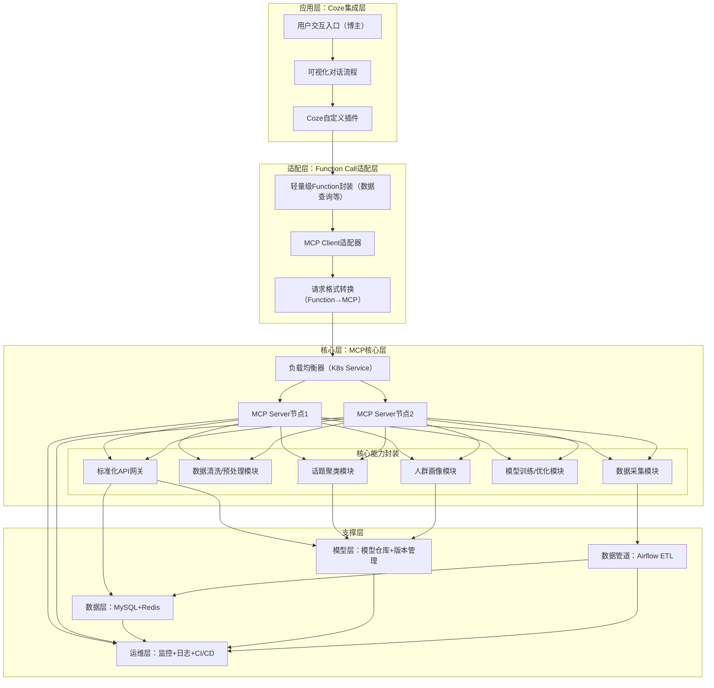

# 「博主智策」全项目设计与实施方案（MCP+Function Call+Coze）

# 一、项目概述

## 1.1 项目目标

基于字节跳动Coze（即梦AI）平台，构建一款面向自媒体博主的高流量内容分析与选题推荐系统，通过MCP核心层封装全流程核心能力，Function Call适配层实现快速集成，Coze集成层降低用户使用门槛，最终为博主提供“话题挖掘-人群定位-选题推荐”一站式服务；同时完整覆盖数据处理、数据管道、模型开发训练、模型部署运维全岗位职责，以及Python、机器学习、深度学习、Docker/K8s、API等全部技术栈要求。

## 1.2 项目范围

- 数据层：B站高播放量内容数据（结构化+非结构化）的采集、清洗、预处理、标注；

- 管道层：自动化ETL数据管道设计与实施，保障数据质量、可用性和高效访问；

- 模型层：话题聚类、语义理解、人群画像分析相关的机器学习/深度学习模型开发、训练、优化；

- 服务层：MCP Server搭建、标准化API开发、微服务架构设计，支持模型部署、再训练和版本管理；

- 适配层：轻量级Function Call开发，实现与MCP核心层的兼容，快速集成到Coze平台；

- 应用层：Coze自定义插件开发、对话流程设计，为博主提供可视化、低代码的选题查询入口。

## 1.3 核心价值

解决新手博主“不知选什么话题、不知面向什么人群”的核心痛点，通过AI技术挖掘全网高流量规律，输出可落地的选题建议和人群定位，同时基于Coze平台的易用性，让博主无需掌握技术，仅通过自然语言对话即可获取服务。

## 1.4 技术栈总览

|技术类别|核心技术|应用场景|
|---|---|---|
|编程语言|Python（必备）、Java（了解）|全流程开发、MCP Server、Function Call、模型开发|
|Python库|NumPy、Pandas、Matplotlib/Seaborn|数据清洗、预处理、可视化|
|数据存储与查询|SQL（MySQL）、Redis|数据存储、缓存、高效查询|
|数据结构与算法|数组、链表、哈希表、排序、搜索、动态规划|数据去重、高效查询、模型优化|
|机器学习|K-Means、DBSCAN、PCA、t-SNE、随机森林|话题聚类、特征分析、降维可视化|
|深度学习|Transformer（BERT）、LSTM、CNN|文本语义向量化、话题热度时序分析|
|模型框架|PyTorch、TensorFlow、Keras、Scikit-learn|模型开发、训练、调试、优化|
|部署与运维|Docker、Kubernetes（K8s）|MCP Server容器化、高可用编排|
|API与微服务|RESTful API、gRPC|标准化服务开发、模型推理服务、微服务集成|
|其他工具|Airflow、Git、GitHub Actions|数据管道调度、版本管理、CI/CD|

# 二、整体架构设计

项目采用“三层架构+全流程支撑”模式，自上而下分为Coze集成层、Function Call适配层、MCP核心层，同时配套数据层、模型层、运维层，确保各模块解耦、可扩展、高可用，架构图如下：


架构核心逻辑：博主通过Coze平台发起需求（如“美妆博主选题推荐”）→ Coze调用Function Call适配层的轻量级函数 → 适配层通过MCP Client将请求转换为MCP标准格式，发送至MCP核心层 → MCP Server负载均衡处理请求，调用内部封装的核心能力（数据处理、模型推理等）→ 核心层将结果通过标准化API返回至适配层 → 适配层转换格式后返回Coze → Coze以自然语言形式呈现给博主。

# 三、当前仓库的“落地实现”对照

这份方案里提到的 MCP / Function Call / Coze 属于“产品化集成形态”。当前仓库已经把核心能力以 Flask API 的形式跑通，你可以把它当成“核心层能力封装”的最小可用实现；后续再把这个 API 通过 OpenAPI/插件接入 Coze，或再封装成 MCP Server 都可行。

## 3.1 模块到代码的映射

- 数据采集模块：Scrapy 爬虫 [video.py](file:///f:/就业/项目/博主项目/src/bilibili_scraper/bilibili_scraper/spiders/video.py)
- 数据存储模块：MySQL + SQLAlchemy 表模型 [db_setup.py](file:///f:/就业/项目/博主项目/scripts/db_setup.py)
- 入库/清洗模块：JSON → MySQL [load_data_to_db.py](file:///f:/就业/项目/博主项目/scripts/load_data_to_db.py)
- 话题聚类模块：BERT 向量 + K-Means/DBSCAN + t-SNE + 特征重要性 [topic_clustering.py](file:///f:/就业/项目/博主项目/scripts/topic_clustering.py)
- 预测模块：播放量回归 + 分档分类 [train_view_predictor.py](file:///f:/就业/项目/博主项目/scripts/train_view_predictor.py)
- 服务层（API+页面）：Flask [app.py](file:///f:/就业/项目/博主项目/app/app.py) + 页面 [index.html](file:///f:/就业/项目/博主项目/app/templates/index.html)
- 插件对接（OpenAPI）：[openapi.yaml](file:///f:/就业/项目/博主项目/openapi.yaml)

## 3.2 服务侧已经实现的接口

- GET /api/topics：话题簇列表（K-Means；按总播放量降序）
- GET /api/analysis_summary：聚类摘要（K-Means 计数、DBSCAN 噪声比例等）
- POST /api/predict_view：预测播放量（回归，需模型 joblib）
- POST /api/predict_bucket：预测播放量分档（分类，需模型 joblib）
- POST /api/title_advice：标题建议（相似爆款/关键词/类目推荐；预测可选）

# 四、到底怎么跑：两种运行模式（快 / 全）

## 4.1 模式 A：只启动 Web/API（最省事）

适合：只想先把页面与接口跑起来看效果，不想先装 MySQL。

前提：models/videos_with_clusters_and_coords.csv 存在（仓库已内置）。

```
cd f:\就业\项目\博主项目
python app\app.py
```

打开：

- http://127.0.0.1:5000

说明：

- 页面只依赖 /api/topics 和 static 目录下两张图（kmeans_tsne_visualization.png、feature_importance.png）。
- /api/title_advice 的“相似爆款”来自服务启动时构建的 TF-IDF 相似度矩阵（基于 CSV 中的标题）。

## 4.2 模式 B：全量重新生成（抓取 → 入库 → 聚类 → 训练 → 重启）

适合：你要用“最新热门数据”更新聚类结果、可视化图、预测模型。

### 0) 准备 MySQL 与环境变量

先创建数据库（默认 bilibili_data）：

```sql
CREATE DATABASE bilibili_data CHARACTER SET utf8mb4 COLLATE utf8mb4_general_ci;
```

Windows PowerShell：

```
$env:DB_USER="root"
$env:DB_PASSWORD="你的数据库密码"
$env:DB_HOST="localhost"
$env:DB_PORT="3306"
$env:DB_NAME="bilibili_data"
```

### 1) 建表

```
python f:\就业\项目\博主项目\scripts\db_setup.py
```

### 2) 抓取热门数据（覆盖 output.json）

```
cd f:\就业\项目\博主项目\src\bilibili_scraper
scrapy crawl video -a target_count=5000 -O output.json
```

要点：

- spider 默认每页 20 条，5000 条约 250 页
- spider 内置下载延迟 2 秒（防止过快请求）
- `-O` 是覆盖写入，避免多次执行叠加导致 JSON 格式混乱

### 3) 入库（会 TRUNCATE videos）

```
cd f:\就业\项目\博主项目
python scripts\load_data_to_db.py
```

### 4) 重新聚类/建模分析（生成 CSV / 模型 / 图）

该脚本强制从 MySQL 读数据，并会用到 BERT（transformers + torch）。

```
pip install transformers torch
python scripts\topic_clustering.py
```

会更新：

- models/videos_with_clusters_and_coords.csv
- models/bert_embeddings.npy
- models/bert_kmeans_model.pkl、models/bert_dbscan_model.pkl
- models/kmeans_tsne_visualization.png、models/feature_importance.png

### 5)（可选）重新训练“标题预测播放量/分档”模型

```
python scripts\train_view_predictor.py
```

会更新：

- models/view_predictor.joblib
- models/view_bucket_classifier.joblib

### 6) 重启 Web 服务（让页面读到新 CSV/模型）

```
python app\app.py
```

# 五、Coze/插件接入（落地路径）

仓库已提供 OpenAPI 文件 openapi.yaml，可直接作为 Coze 插件的接口描述来源。实际接入时需要把服务暴露到公网，并把 openapi.yaml 里的 `servers.url` 改成你对外可访问的域名（例如用 cloudflared/ngrok 把本地 5000 端口映射出去）。

# 六、排障速查

- `topic_clustering.py` 提示 DB_PASSWORD 未设置：该脚本必须从 MySQL 读数据，确认 PowerShell 已设置 `$env:DB_PASSWORD` 且库可连。
- 爬虫抓不到 5000 条：先用小 target_count 验证；再考虑降频/重试/代理；入口都在 spider 的 parse/翻页逻辑里。
- 启动 Flask 提示 CSV 不存在：先执行聚类脚本生成 models/videos_with_clusters_and_coords.csv，或切换到“模式 A（仓库内置 CSV）”。
